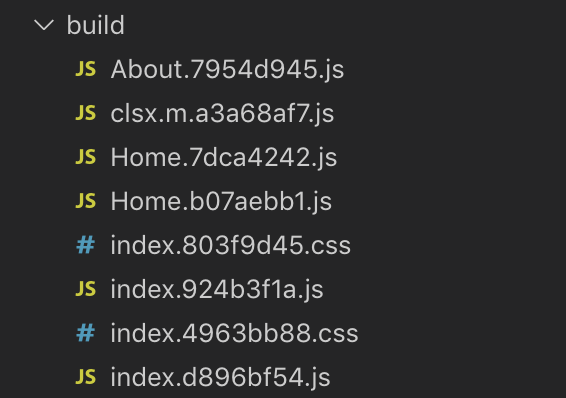
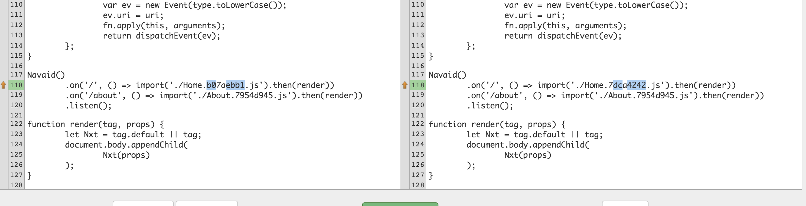

# bug-rollup-css-hashes

When there are enough combinations of dynamic imports, shared dependency trees, and CSS files (emitted references) involved, the Rollup hashes _can_ be inconsistent between builds.

## Steps

```sh
# install deps
$ npm install

# loop build 10-25 times
for n in {1..10}; do npm run build; done
```

The bug typically appears within 10 builds.
What you'll see is that `Home.xxxx.js` and `index.xxxxx.js` are duplicated.



When looking at contents, the two `Home.xxxx.js` files' contents are identical – ***despite*** having different destination hashes.

Because of the change in hash, the `index.xxxx.js` files are different, but ***only*** when dynamically importing the built `Home.xxxx.js` file:


